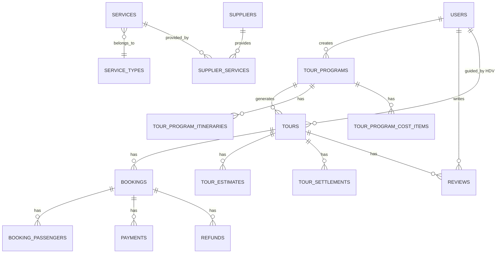

# Travela Tour Booking System — Bản Phác Thảo Kiến Trúc Chi Tiết
## (Phiên bản đồ án tốt nghiệp — Stack gọn nhẹ)

---

## Đối chiếu nguồn tài liệu (Cross-reference)

> Bảng dưới đây đối chiếu **từng mục** trong 5 tài liệu gốc → đã được cover ở đâu trong plan.

### Tài liệu 1: `Kịch bản UC-Diễn giải luồng.md` — **[FLOW]**

| # | Nội dung gốc | Cover tại | Trạng thái |
|---|-------------|-----------|:---:|
| 1 | Dự toán chương trình tour (NV R&D) — 5 giai đoạn lifecycle | §5.1 + §5.2 | ✅ |
| 2 | Điều kiện tour vào vận hành (hết hạn đặt + đủ khách) | §5.2 lifecycle | ✅ |
| 3 | Dự toán tour (NV điều hành) — chọn NCC cụ thể, tính lợi nhuận | §5.2 Dự toán chi phí | ✅ |
| 4 | Điều phối tour — phân công HDV, gửi email | §5.2 Điều phối HDV | ✅ |
| 5 | Quyết toán — cập nhật chi phí phát sinh, đánh giá hiệu quả | §5.2 Quyết toán | ✅ |
| 6 | Phân quyền quản lý dịch vụ (R&D + Điều hành) | §3 + §5.3 | ✅ |
| 7 | CRUD Dịch vụ (6 loại, hình thức giá, kiểu đối tượng, tỉnh/thành, tùy chọn sức chứa) | §5.3 Dịch vụ | ✅ |
| 8 | CRUD Nhà cung cấp (tên, SĐT, loại, địa chỉ, hạng sao KS, tỉnh thành hoạt động) | §5.3 NCC | ✅ |
| 9 | Gán dịch vụ vào NCC (giá theo đối tượng, tùy chọn, dịch vụ ăn thêm trực tiếp) | §5.3 Gán dịch vụ | ✅ |
| 10 | Dịch vụ HDV đặc biệt (NCC = công ty, 1 dịch vụ, giá mặc định) | §5.3 HDV | ✅ |
| 11 | Điều chỉnh giá (NV điều hành) — gửi yêu cầu duyệt | §5.3 Xử lý giá | ✅ |
| 12 | Xử lý cập nhật giá (3 trường hợp, thông báo R&D, popup xác nhận) | §5.3 Xử lý giá | ✅ |

### Tài liệu 2: `Kịch bản UC-Qly Booking + Báo cáo.md` — **[BOOK]**

| # | Nội dung gốc | Cover tại | Trạng thái |
|---|-------------|-----------|:---:|
| 1 | Tìm kiếm đơn đặt tour (NV KD) — tìm theo mã tour, tên tour, tên KH, SĐT | §5.4 Booking | ✅ |
| 2 | Xác nhận đơn (NV KD) — tab Chưa xác nhận, popup confirm, xem chi tiết + danh sách hành khách | §5.4 Xác nhận | ✅ |
| 3 | Hoàn tiền (NV KD) — tab Đã hủy, lọc Chưa hoàn/Đã hoàn, upload bill, gửi email | §5.4 Hoàn tiền | ✅ |
| 4 | Dashboard — 6 widgets + 3 bộ lọc (thời gian, điểm đến, khoảng giá) | §5.5 Dashboard | ✅ |
| 5 | Xuất báo cáo Excel — chọn nhiều loại → mỗi loại 1 sheet, auto download | §5.5 Xuất Excel | ✅ |
| 6 | Luồng phụ dashboard — thời gian không hợp lệ → mặc định 1 tháng | §5.5 | ✅ |

### Tài liệu 3: `Kịch bản UC-Qly Tour + Điều phối.md` — **[TOUR]**

| # | Nội dung gốc | Cover tại | Trạng thái |
|---|-------------|-----------|:---:|
| 1 | Tạo chương trình tour — Bước 1 thông tin chung (tên, thời lượng, điểm đến, kiểu chu kỳ SEASONAL/YEAR_ROUND) | §5.1 Bước 1 | ✅ |
| 2 | Quy tắc sinh tour: SEASONAL (thủ công/tự động, DAILY/WEEKLY_SCHEDULE) | §5.1 Bước 1 | ✅ |
| 3 | Quy tắc sinh tour: YEAR_ROUND (ngày bắt đầu + số tour sinh trước) | §5.1 Bước 1 | ✅ |
| 4 | Rà soát ngày khởi hành dự kiến — cho phép xóa bớt | §5.1 Bước 1 | ✅ |
| 5 | Bước 2 — Lịch trình (số ô = số ngày, tiêu đề + mô tả) | §5.1 Bước 2 | ✅ |
| 6 | Bước 3 — Dự toán: Vận chuyển (3 hình thức giá, tùy chọn sức chứa, chọn NCC chính) | §5.1 Bước 3 | ✅ |
| 7 | Bước 3 — Chi phí ăn (chia ngày × bữa, chọn checkbox, lọc điểm đến, NCC chính) | §5.1 Bước 3 | ✅ |
| 8 | Bước 3 — Khách sạn (tiêu chuẩn sao, 3 thiết lập lưu trú, popup chia nhóm, lọc NCC) | §5.1 Bước 3 | ✅ |
| 9 | Bước 3 — Vé thắng cảnh (chia theo ngày, giá NL/TE, mỗi DV chỉ 1 lần) | §5.1 Bước 3 | ✅ |
| 10 | Bước 3 — HDV (đơn giá mặc định, số lần = số ngày hoặc +0.5) | §5.1 Bước 3 | ✅ |
| 11 | Bước 3 — Chi phí khác (số lần mặc định 1) | §5.1 Bước 3 | ✅ |
| 12 | Công thức tính: Giá net, Giá bán, Số khách tối thiểu | §5.1 Công thức | ✅ |
| 13 | Lưu nháp / Gửi phê duyệt (sinh mã chương trình) | §5.1 Trạng thái | ✅ |
| 14 | Phê duyệt chương trình (Quản lý) — duyệt/từ chối + lý do | §5.1 Trạng thái | ✅ |
| 15 | Duyệt tour sinh ra — Cronjob YEAR_ROUND, NV Điều hành duyệt, Quản lý duyệt | §5.1 Sinh tour | ✅ |
| 16 | Dự toán chi phí tour (NV ĐH) — tổng thu/chi, expand NCC dự phòng, điều chỉnh giá popup | §5.2 Dự toán | ✅ |
| 17 | Phê duyệt dự toán (Quản lý) | §5.2 | ✅ |
| 18 | Tạo hồ sơ tour — popup HDV (lịch trống, kinh nghiệm), gửi email | §5.2 Điều phối | ✅ |
| 19 | Quyết toán — chỉnh sửa đơn giá/SL, highlight đỏ, icon ↑↓, % hover | §5.2 Quyết toán | ✅ |
| 20 | Ngừng kinh doanh — nhập lý do, cancel tour chưa có booking, thông báo | §5.2 Ngừng KD | ✅ |
| 21 | Sửa tour — Nháp → sửa thoải mái, khác → chỉ sửa mô tả | §5.2 Sửa tour | ✅ |

### Tài liệu 4: `Mô tả chi tiết usecase.md` — **[UC]**

| # | Nội dung gốc | Cover tại | Trạng thái |
|---|-------------|-----------|:---:|
| 1 | Xem danh sách tour / Xem chi tiết tour | §5.4 + §8 routing | ✅ |
| 2 | Tìm kiếm tour (tên/điểm đến/thời gian) | §5.4 | ✅ |
| 3 | Đặt tour — full flow (auto-fill đăng nhập, danh sách hành khách NL/TE/Em bé, 3 cổng thanh toán, check chỗ trống real-time, luồng phụ + ngoại lệ) | §5.4 Đặt tour | ✅ |
| 4 | Hủy tour — full flow (kiểm tra thời hạn, chính sách phí, form ngân hàng, khôi phục slots, email) | §5.4 Hủy tour | ✅ |
| 5 | Đánh giá tour (1-5 sao, text, ảnh/video opt, tính rating TB) | §5.6 | ✅ |
| 6 | Thêm người dùng (mã, tên, vai trò) | §5.7 | ✅ |
| 7 | Tìm kiếm người dùng (mã, tên) | §5.7 | ✅ |
| 8 | Sửa người dùng | §5.7 | ✅ |
| 9 | Xóa người dùng (soft delete, không xóa chính mình, ràng buộc dữ liệu, lỗi kết nối) | §5.7 | ✅ |

### Tài liệu 5: `Phân quyền và chức năng hệ thống.html` — **[PERM]**

| # | Nội dung gốc | Cover tại | Trạng thái |
|---|-------------|-----------|:---:|
| 1 | Admin — QL người dùng (thêm, sửa, vô hiệu hóa) | §3 + §5.7 | ✅ |
| 2 | Quản lý — Phê duyệt CT tour, Ngừng KD, Duyệt dự toán, Hủy/Delay tour, Dashboard | §3 | ✅ |
| 3 | NV Điều phối — Tạo CT tour, Sửa/Xóa CT do mình tạo, Duyệt tour sinh ra, Dự toán, Phân công HDV, Quyết toán, QL dịch vụ, Dashboard, Voucher | §3 | ✅ |
| 4 | NV Kinh doanh — QL booking, Hoàn thiện thông tin nhu cầu khách, Thanh toán, Hoàn tiền | §3 + §5.4 | ✅ |
| 5 | KH đăng nhập — Xem/tìm/đặt/hủy tour, sửa thông tin đặt, lịch sử, đánh giá, wishlist | §3 | ✅ |
| 6 | KH vãng lai — Xem/tìm/đặt/hủy tour, sửa thông tin đặt | §3 | ✅ |

### Các mục có tên trong phân quyền nhưng CHƯA CÓ UC chi tiết

> [!WARNING]
> 4 chức năng dưới đây được đề cập trong bảng phân quyền **[PERM]** nhưng **không có kịch bản UC chi tiết** trong tài liệu gốc. Plan vẫn dự trù slot cho chúng, khi build sẽ cần anh clarify thêm.

| Chức năng | Vai trò | Ghi chú |
|-----------|---------|---------|
| **Delay tour** | Quản lý | Chỉ nhắc tên, không có UC. Có thể tương tự Ngừng KD nhưng tạm thời? |
| **Voucher** | NV Điều phối | Chỉ nhắc tên, không có UC. Cần define: tạo/sửa/xóa voucher, áp dụng khi đặt tour? |
| **Wishlist** | KH đăng nhập | Chỉ nhắc tên. Cơ bản: thêm/xóa tour yêu thích |
| **Hoàn thiện thông tin nhu cầu khách** | NV Kinh doanh | Đề cập trong [PERM], liên quan đến phòng lưu trú trong dự toán tour. Cần clarify flow |

---

## 1. Tech Stack (Gọn nhẹ — Đồ án TN)

| Layer | Tech | Chi tiết |
|-------|------|----------|
| **Frontend** | ReactJS | + Ant Design (UI) + Zustand (state) + React Router v6 + Recharts (charts) |
| **Backend** | NestJS | + Prisma (ORM) + Swagger (API docs) + class-validator + **Passport JWT** + **bcrypt** (hash password) |
| **Database** | PostgreSQL | Duy nhất. Refresh token lưu trong DB |
| **Container** | Docker Compose | 3 services: `frontend`, `backend`, `postgres` |
| **Utilities** | | Nodemailer (email), Multer (upload file local), ExcelJS (export), @nestjs/schedule (cron) |

> [!NOTE]
> **Không dùng:** Redis, Bull Queue, Socket.IO, MinIO, Nginx — giữ đơn giản cho scope đồ án.

---

## 2. Phân quyền — từ **[PERM]**

```
Roles: ADMIN | MANAGER | COORDINATOR | SALES | CUSTOMER
```

| Module | Admin | Quản lý | NV Điều phối | NV Kinh doanh | KH đăng nhập | KH vãng lai |
|---|:---:|:---:|:---:|:---:|:---:|:---:|
| QL người dùng | ✅ | — | — | — | — | — |
| CT tour - Tạo/Sửa/Xóa | — | — | ✅ (của mình) | — | — | — |
| CT tour - Duyệt | — | ✅ | — | — | — | — |
| CT tour - Ngừng KD | — | ✅ | ✅ (của mình) | — | — | — |
| Tour - Duyệt sinh ra | — | ✅ | ✅ | — | — | — |
| Tour - Dự toán | — | — | ✅ | — | — | — |
| Tour - Duyệt dự toán | — | ✅ | — | — | — | — |
| Tour - Phân công HDV | — | — | ✅ | — | — | — |
| Tour - Quyết toán | — | — | ✅ | — | — | — |
| Tour - Hủy/Delay | — | ✅ | — | — | — | — |
| QL Dịch vụ & NCC | — | — | ✅ | — | — | — |
| Booking - Xác nhận | — | — | — | ✅ | — | — |
| Booking - Hoàn tiền | — | — | — | ✅ | — | — |
| Dashboard | — | ✅ | ✅ | — | — | — |
| Voucher | — | — | ✅ | — | — | — |
| Xem/tìm/đặt tour | — | — | — | — | ✅ | ✅ |
| Hủy tour | — | — | — | — | ✅ | ✅ |
| Đánh giá | — | — | — | — | ✅ | — |
| Wishlist | — | — | — | — | ✅ | — |

**Implementation:** NestJS Guards + `@Roles()` decorator + ownership check.

---

## 3. Kiến trúc tổng thể

```
┌───────────────────────────────────────┐
│              CLIENTS                   │
│  ┌─────────────┐  ┌───────────────┐   │
│  │ Customer FE │  │   Admin FE    │   │
│  │  (ReactJS)  │  │  (ReactJS)    │   │
│  └──────┬──────┘  └──────┬────────┘   │
└─────────┼────────────────┼────────────┘
          └───────┬────────┘
                  │
┌─────────────────┼─────────────────────┐
│          BACKEND (NestJS)              │
│  Auth │ Users │ TourPrograms │ Tours   │
│  Services │ Bookings │ Payments        │
│  Reviews │ Dashboard │ Vouchers        │
│  Notifications │ Files │ Scheduler     │
└─────────────────┼─────────────────────┘
                  │
         ┌────────┴────────┐
         │   PostgreSQL    │
         └─────────────────┘
```

**Docker Compose:** `frontend` (port 3000) + `backend` (port 8001) + `postgres` (port 5432)

---

## 4. Module nghiệp vụ chi tiết

### 4.1 Quản lý Chương trình Tour — **[FLOW] + [TOUR]**

#### Tạo chương trình (3 bước)

**Bước 1 — Thông tin chung:**
- Tên, thời lượng (ngày/đêm — chênh ≤ 1), mô tả, điểm khởi hành, điểm đến (multi)
- Kiểu chu kỳ: `SEASONAL` (thủ công/tự động) | `YEAR_ROUND` (ngày bắt đầu + số tour sinh trước)
- Loại khởi hành: `DAILY` | `WEEKLY_SCHEDULE` (chọn thứ)
- Rà soát danh sách ngày khởi hành → cho xóa bớt

**Bước 2 — Lịch trình:** Số ô = số ngày, mỗi ô: tiêu đề + mô tả

**Bước 3 — Dự toán (6 khoản mục):**

| Khoản mục | Hình thức giá | Đặc thù |
|-----------|--------------|---------|
| Vận chuyển | 3 loại: Báo giá NCC / Giá danh mục / Nhập tay | Tùy chọn sức chứa (16/29/45 chỗ). Đơn giá = xe phù hợp số khách |
| Chi phí ăn | Giá danh mục | Chia theo ngày × bữa (checkbox sáng/trưa/tối). Lọc theo 1 điểm đến/bữa/ngày |
| Khách sạn | Giá danh mục | 3 thiết lập: 1 KS xuyên suốt / mỗi đêm 1 KS / tự chia nhóm. Lọc theo sao + địa điểm. Thành tiền = giá phòng đôi × số đêm |
| Vé thắng cảnh | Giá danh mục | Chia theo ngày, giá NL/TE, mỗi DV chỉ chọn 1 lần toàn tour |
| HDV | Cố định | Đơn giá mặc định. Số lần = số ngày (hoặc +0.5 nếu đêm > ngày) |
| Chi phí khác | Giá danh mục | Số lần mặc định = 1, tùy chỉnh |

**Công thức tính:**
```
Giá net = Chi phí cố định / Số khách dự kiến + Chi phí biến đổi
Giá bán = Giá net × (1 + %LN) × (1 + %Thuế) × (1 + %CP khác)
Số khách tối thiểu = Chi phí cố định / (Giá bán NL − Chi phí biến đổi)

Chi phí cố định: vận chuyển (đơn vị ≠ người) + HDV
Khách sạn: chia đôi (phòng đôi → chi phí 1 người)
```

**Trạng thái:** `Nháp → Chờ duyệt → Đang mở bán → Ngừng KD` (Từ chối → quay Nháp)

**Sinh tour tự động (Cronjob):** YEAR_ROUND, nếu `tour mở bán < số sinh trước` → sinh tour `Nháp` → NV duyệt → QL duyệt → `Mở bán`

**Sửa tour:** Nháp → sửa thoải mái. Trạng thái khác → chỉ sửa mô tả.

---

### 4.2 Quản lý Tour — **[FLOW] + [TOUR]**

**Lifecycle:**
```
Mở bán → (hết hạn đặt + đủ khách) → Chờ điều hành → Chờ dự toán
→ Chờ duyệt dự toán → Chờ điều phối → Đang triển khai
→ (qua ngày kết thúc) → Chờ quyết toán → Hoàn thành
```

**Dự toán chi phí (NV Điều phối):**
- Tổng thu: Tour NL + Tour TE + Phụ thu
- Khoản chi: kế thừa từ CT tour, chọn NCC cụ thể (expand NCC dự phòng)
- Điều chỉnh giá: popup (giá gốc, giá mới, lý do radio, yêu cầu cập nhật bảng giá Y/N)
- Lợi nhuận dự kiến = Tổng thu − Tổng chi

**Điều phối HDV:** Popup HDV lịch trống (tên, SĐT, số lần dẫn tour này/tương tự, kinh nghiệm) → gửi email

**Quyết toán:** Giống dự toán nhưng chỉnh đơn giá + SL trực tiếp. Highlight đỏ thay đổi, icon ↑/↓ + % hover

**Ngừng KD:** Nhập lý do → cancel tour chưa có booking → thông báo NV. R&D ngừng KD → cần QL phê duyệt trước

---

### 4.3 Quản lý Dịch vụ & NCC — **[FLOW]**

**Dịch vụ:** Tên, loại (6 loại), hình thức giá, kiểu đối tượng (Tất cả / NL&TE), tỉnh/thành (vé TC), tùy chọn sức chứa

**NCC:** Tên, SĐT, loại (trừ HDV), địa chỉ, tỉnh/thành, năm thành lập, đánh giá nội bộ (1-5★). Bổ sung: KS → hạng sao | VC → tỉnh thành hoạt động

**Gán DV vào NCC:** Nhập giá theo đối tượng + tùy chọn. Ăn uống: thêm DV trực tiếp từ màn NCC

**HDV đặc biệt:** NCC = công ty, 1 DV duy nhất, giá mặc định, chỉ sửa tại màn NCC

**Xử lý giá:** 3 trường hợp cập nhật → popup xác nhận → thông báo R&D → giữ/đổi NCC

---

### 4.4 Booking — **[BOOK] + [UC]**

**Đặt tour (KH):** Chọn lịch KH → điền info (auto-fill nếu đăng nhập) → danh sách HK (NL/TE/Em bé: tên, ngày sinh, giới tính, nhu cầu phòng đơn) → chọn thanh toán (VNPay/Stripe/Văn phòng) → check chỗ trống real-time → thanh toán → tạo booking + email. Luồng phụ: validation sai, TT thất bại. Ngoại lệ: hết chỗ phút chót

**Hủy tour (KH):** Kiểm tra thời hạn → form chính sách phí + thông tin ngân hàng → cập nhật "Chờ hoàn tiền" + khôi phục slots + email. KH vãng lai: tra cứu bằng mã booking

**Xác nhận (NV KD):** Tab Chưa xác nhận → popup confirm → Đã xác nhận. Hoặc xem chi tiết (Mã đơn, Tên tour, ngày KH/KT, SL khách, người đặt, SĐT, TT toán, trạng thái, DS hành khách) → xác nhận

**Hoàn tiền (NV KD):** Tab Đã hủy → lọc Chưa hoàn/Đã hoàn → upload ảnh bill → xác nhận → email KH

**Tìm kiếm (NV KD):** Tìm theo mã tour, tên tour, tên KH, SĐT

---

### 4.5 Dashboard & Báo cáo — **[BOOK]**

**Bộ lọc:** Thời gian (mặc định 1 tháng), Điểm đến (dropdown), Khoảng giá

**6 Widgets:** Top 5 tour doanh thu | Điểm đến thu hút nhất | Doanh thu | Tổng đơn hoàn thành | Tỉ lệ hủy | Phương thức TT (pie chart)

**Xuất Excel:** Popup chọn loại BC → mỗi loại = 1 sheet → auto download `.xlsx`. Fallback: thời gian ko hợp lệ → mặc định 1 tháng

---

### 4.6 Đánh giá Tour — **[UC]**

Rating 1-5★ + nội dung text + ảnh/video (optional). Điều kiện: đã hoàn thành + chưa đánh giá. Auto tính rating TB. Hiển thị công khai trên trang chi tiết tour.

---

### 4.7 Quản lý Người dùng — **[UC] + [PERM]**

CRUD (Admin only). Trường: mã, tên, vai trò. Soft delete (delete=1). Ràng buộc: không xóa chính mình, kiểm tra dữ liệu liên quan, xử lý lỗi kết nối.

---

## 5. Database Schema

### Bảng chính (20+ bảng)

```
─── AUTH ───
users, roles

─── CHƯƠNG TRÌNH TOUR ───
tour_programs, tour_program_itineraries,
tour_program_cost_items, departure_rules

─── TOUR ───
tours, tour_estimates, tour_estimate_items,
tour_settlements, tour_settlement_items

─── DỊCH VỤ & NCC ───
service_types, services, service_options,
suppliers, supplier_services, supplier_operating_areas

─── BOOKING ───
bookings, booking_passengers, payments, refunds

─── MISC ───
reviews, wishlists, vouchers, notifications,
price_change_requests, provinces
```

### ER Diagram



---

## 6. API Endpoints

| Module | Method | Endpoint | Role |
|--------|--------|----------|------|
| Auth | POST | `/auth/login`, `/auth/register`, `/auth/refresh` | Public |
| Users | CRUD | `/users` | Admin |
| Tour Programs | CRUD | `/tour-programs` | Coordinator |
| Tour Programs | POST | `/tour-programs/:id/approve`, `/reject` | Manager |
| Tours | GET | `/tours` (với tabs theo trạng thái) | Multi |
| Tours | POST | `/tours/:id/take-operation` | Coordinator |
| Tours | POST | `/tours/:id/estimate` | Coordinator |
| Tours | POST | `/tours/:id/estimate/approve` | Manager |
| Tours | POST | `/tours/:id/assign-guide` | Coordinator |
| Tours | POST | `/tours/:id/settle` | Coordinator |
| Services | CRUD | `/services` | Coordinator |
| Suppliers | CRUD | `/suppliers` | Coordinator |
| Bookings | POST | `/bookings` | Customer |
| Bookings | POST | `/bookings/:id/confirm` | Sales |
| Bookings | POST | `/bookings/:id/cancel` | Customer |
| Bookings | POST | `/bookings/:id/refund` | Sales |
| Reviews | POST | `/reviews` | Customer |
| Dashboard | GET | `/dashboard/stats`, `/dashboard/export` | Manager, Coordinator |
| Public | GET | `/public/tours`, `/public/tours/:id` | Public |

---

## 7. Frontend Structure

### Routing

```
/                              → Landing page
/tours                         → Danh sách tour + tìm kiếm
/tours/:slug                   → Chi tiết tour
/tours/:slug/book              → Đặt tour (multi-step)
/booking/lookup                → Tra cứu booking (KH vãng lai)
/customer/bookings             → Lịch sử (tabs: Chờ KH / Đã hoàn thành)
/customer/wishlist             → Wishlist

/admin/dashboard               → Dashboard + xuất Excel
/admin/users                   → QL người dùng
/admin/tour-programs           → QL chương trình tour (tabs: Current / Nháp / Chờ duyệt)
/admin/tour-programs/create    → Wizard 3 bước
/admin/tours                   → QL tour (tabs: Current / Chờ ĐH / Chờ dự toán / ...)
/admin/tours/:id/estimate      → Dự toán
/admin/tours/:id/settle        → Quyết toán
/admin/services                → QL dịch vụ
/admin/suppliers               → QL NCC
/admin/bookings                → QL booking (tabs: Chưa XN / Đã XN / Đã hủy)
/admin/vouchers                → QL voucher
```

---

## 8. Chiến lược phát triển & Roadmap

### Phương pháp: Frontend-first với Mock Data

> **Giai đoạn 1:** Build toàn bộ giao diện + mô phỏng cơ chế với mock data. Tất cả các nút, form, flow đều chạy được.
> **Giai đoạn 2:** Lắp backend (NestJS + PostgreSQL), thay mock data bằng API thật, deploy + testing.

### Giai đoạn 1: Frontend + Mock Data

| Phase | Nội dung | Ước tính |
|-------|---------|----------|
| **F1. Setup & Design System** | Vite + React + Ant Design, routing, layout, theme, design tokens | 2-3 ngày |
| **F2. Auth UI** | Login, Register (mock JWT, mock roles) | 1-2 ngày |
| **F3. Public Pages** | Landing, Tour list, Tour detail, Search, Booking flow, Payment mock | 3-5 ngày |
| **F4. Admin - Tour Program** | Wizard 3 bước, phê duyệt, ngừng KD, danh sách tabs | 4-5 ngày |
| **F5. Admin - Tour Ops** | Dự toán, điều phối HDV, quyết toán, các tabs trạng thái | 4-5 ngày |
| **F6. Admin - Services** | CRUD dịch vụ, NCC, gán giá | 2-3 ngày |
| **F7. Admin - Booking** | Xác nhận, hoàn tiền, tabs, tìm kiếm | 2-3 ngày |
| **F8. Admin - Dashboard** | 6 widgets, bộ lọc, xuất Excel mock | 2-3 ngày |
| **F9. Extras** | Users CRUD, Reviews, Wishlist, Voucher, Notifications | 2-3 ngày |

**Tổng GĐ1: ~3-4 tuần**

### Giai đoạn 2: Backend + Integration

| Phase | Nội dung | Ước tính |
|-------|---------|----------|
| **B1. Setup** | NestJS + Prisma + Docker + DB schema + Swagger | 3-4 ngày |
| **B2. Auth** | JWT (access + refresh in DB) + bcrypt hash password + RBAC guards | 2-3 ngày |
| **B3. Core APIs** | Services, Suppliers, Provinces, Users | 3-4 ngày |
| **B4. Tour APIs** | Tour programs, Tours, Estimates, Settlements, Cronjob | 5-7 ngày |
| **B5. Booking APIs** | Bookings, Payments (VNPay/Stripe), Refunds | 3-5 ngày |
| **B6. Extras APIs** | Dashboard queries, Reviews, Wishlist, Voucher, Email | 3-4 ngày |
| **B7. Integration** | Thay mock data bằng API thật, test tích hợp | 3-5 ngày |
| **B8. Deploy & Test** | Docker compose, testing, bug fix, polish | 3-5 ngày |

**Tổng GĐ2: ~4-5 tuần**

**Tổng cộng: ~7-9 tuần**
